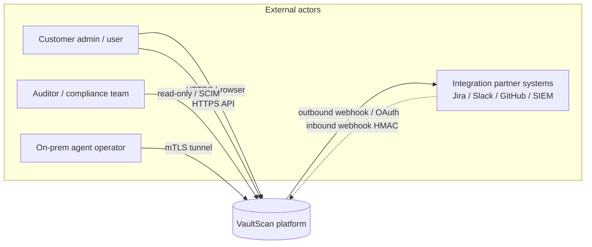
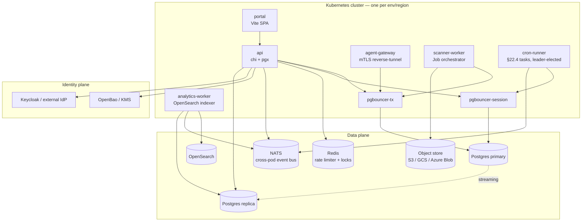

# Architecture

High-level mental model for engineers + operators. For per-feature
detail see the slice docs under `docs/slices/`.

## C4 — Context



## C4 — Container



## C4 — Component (API process)

```mermaid
graph LR
  req[Request] --> reqid[RequestID]
  reqid --> sec[SecurityHeaders]
  sec --> cors[CORS]
  cors --> body[BodyLimit 32MB]
  body --> auth{Authed route?}
  auth -- no --> publichandler
  auth -- yes --> bearer[middleware.Auth]
  bearer --> tenant[TenantScope]
  tenant --> bind[TenantBinding<br/>sets vaultscan.tenant_id GUC]
  bind --> rate[RateLimit<br/>per-IP + per-tenant]
  rate --> perm[RequirePermission]
  perm --> mfa{MFA required?}
  mfa -- yes --> mfaverify[RequireMFA]
  mfaverify --> handler
  mfa -- no --> handler
  handler --> service[Service layer]
  service --> repo[Pool query<br/>via pgbouncer-tx]
  service --> bus[EventBus.Publish]
  service --> audit[Audit.Record]
  audit --> chain[chain_hash = sha256<br/>prev || canonical || payload]
  bus -.-> integrations[Outbound integration delivery]
  bus -.-> analytics[OpenSearch indexer]
```

## Process topology

```
                        ┌────────────────┐
                external│   WAF / edge   │ TLS termination, rate-shape
   customers ─────────► │   (operator-   │ at the perimeter
                        │   provided)    │
                        └────────┬───────┘
                                 │
       ┌─────────────────────────┼──────────────────────────────┐
       │ Kubernetes cluster (one per environment / region)     │
       │                                                       │
       │  ┌──────────┐  ┌──────────────┐  ┌──────────────────┐ │
       │  │  portal  │  │      api     │  │  agent-gateway   │ │ external-facing
       │  │  (Vite)  │  │  (chi + pgx) │  │  (mTLS)          │ │
       │  └────┬─────┘  └──┬───────────┘  └──────┬───────────┘ │
       │       │           │                     │             │
       │       └──┬────────┴─────┬───────────────┘             │
       │          │              │                             │
       │  ┌───────▼──────┐  ┌────▼──────────┐  ┌─────────────┐ │
       │  │  pgbouncer   │  │  analytics-   │  │ scanner-    │ │
       │  │  (tx + sess) │  │  worker       │  │ worker      │ │
       │  └──┬────────┬──┘  └──┬────────────┘  └──┬──────────┘ │
       │     │        │        │                  │            │
       │     │        │        │     ┌────────────┘            │
       │     │        │        │     │                         │
       │  ┌──▼───┐ ┌──▼───┐ ┌──▼─────▼─┐ ┌────────────────┐    │
       │  │ Pg   │ │ Pg   │ │ OpenSearch│ │ scanner-* ns   │    │
       │  │ prim │ │ rep  │ │ (analytics│ │ (per-job Job)  │    │
       │  └──────┘ └──────┘ │  + search)│ └────────────────┘    │
       │                    └───────────┘                       │
       │                                                       │
       │  ┌──────────────┐  ┌──────────────┐                   │
       │  │ cron-runner  │  │  evidence    │                   │
       │  │ (leader-     │  │  vault       │                   │
       │  │  elected)    │  │  (S3 / GCS / │                   │
       │  └──────────────┘  │   Azure /    │                   │
       │                    │   MinIO)     │                   │
       │                    └──────────────┘                   │
       └───────────────────────────────────────────────────────┘

       cmds/api/main.go         → API + dashboards + webhooks ingest
       cmds/agent-gateway/      → mTLS reverse-tunnel from internal agents
       cmds/scanner-worker/     → orchestrates per-tool Kubernetes Jobs
       cmds/analytics-worker/   → indexes Postgres → OpenSearch
       cmds/cron-runner/        → §22.4 scheduled tasks (leader-elected)
       cmds/migrate/            → DB schema migration runner
       cmds/seed/               → fixture data for dev / kind
       cmds/oasgen/             → generates docs/api/openapi.yaml from chi routes
```

## Multi-tenancy model

| Mechanism | Scope | What enforces it |
| --- | --- | --- |
| RLS (Row-Level Security) | Per-row, in Postgres | `vaultscan.tenant_id` GUC set by `middleware.TenantBinding` |
| Tenant pool routing | Per-tenant DB pool / shard | `tenant_pool_routing` table + `db.RouterFor` |
| Tenant data keys | Per-tenant DEK | `tenant_data_keys` + `evidence.Vault` envelope encrypt |
| Data residency | Per-tenant region pin | `tenants.data_region` + `tenants.CheckResidency` on every write |
| Tenant isolation tiers | Shared vs dedicated | `tenant_isolation_history` + `promoteTenantIsolation` (MFA-gated) |

A tenant boundary is **defense-in-depth**: service-layer code filters
by tenant_id, then RLS enforces it at the DB layer, then the
per-tenant DEK makes data unreadable without the right key version.

## Audit chain

Every mutation lands an `audit_logs` row with:

- `chain_prev BYTEA` — SHA-256 of the previous row's `chain_hash`
- `chain_hash BYTEA` — SHA-256 of `(prev || canonical_metadata || payload)`

The `audit_archive_runs` table records periodic anchors to an
RFC 3161 TSA. Tampering is detected by `audit.VerifyDeep` (hourly
cron task) and surfaces via `vaultscan_audit_chain_breaks_total`.

## Evidence vault

- Envelope encryption: master KEK (env var, ideally KMS-backed) →
  per-tenant DEK (versioned, rotated by `dek_rotation_sweep`).
- WORM via `evidence.EnableWORM` + S3 object lock / GCS retention /
  Azure immutable-blob policies.
- Chain of custody: every `recordCustody` event into
  `evidence_chain_of_custody`.
- Re-wrap on rotation: `dek_rewrap_sweep` walks tenants with
  stale-version objects, re-encrypts under the new DEK, records a
  `rewrapped` custody event.

## Event bus

In-process: `eventbus.Bus` (channel-fanout).
Cross-process: NATS subjects `vaultscan.<event-type>` (Pg NOTIFY
fallback when NATS isn't configured).

Subscribers:
- `integrations.Service.Wire` — outbound delivery to Slack / Jira / etc.
- `analytics.Indexer.Wire` — Postgres → OpenSearch indexing
- `notify.Service` — email / SMS / push when an alert rule matches

## Scheduling

`cron-runner` is the single leader-elected background-task runner.
Tasks defined inline in `cmd/cron-runner/main.go`. Each task has:

1. A name (stable, becomes a Prometheus label)
2. An interval
3. A bounded `fn(ctx)` (each tick has its own timeout)

The Postgres advisory-lock-based leader election lets multiple
replicas run for HA without duplicating work.

## Scanner orchestration

```
  user requests scan
       │
       ▼
 scanorch.Submit  ── creates scan_jobs row + N scan_tasks
       │
       ▼
 scanner-worker picks up queued tasks (advisory-lock dequeue)
       │
       ▼
 Kubernetes Job spawned in scanner-<tool> namespace
       │  - image: pinned digest from tools/scanner-images/digests.json
       │  - resources: CPU / mem caps
       │  - securityContext: tool-specific (most strict; some need root)
       │  - egress NetworkPolicy: restricted to target subnets only
       │
       ▼
 tool runs, writes findings to stdout (parsed by parsers/)
       │
       ▼
 findings.Service.Upsert  ── deduplicates by fingerprint, enriches
       │
       ▼
 analytics-worker indexes for search; integrations.Wire dispatches
```

## Deployment surfaces

| Target | Path |
| --- | --- |
| Local dev (compose) | `make bootstrap` → `infra/compose/docker-compose.yml` |
| Local Kubernetes (kind) | `make tf-local-up CLOUD=generic ENV=dev` |
| Real cloud (AWS / GCP / Azure) | `make tf-apply CLOUD=<cloud> ENV=<env>` |
| BYO cluster | `make tf-apply CLOUD=generic ENV=<env>` + your own kubeconfig |
| Chart only | `make helm-<env>` (assumes cluster + dependencies already exist) |

## Hot-path data flow (typical request)

```
client → edge → ingress-nginx → api pod
  → middleware.Auth (JWT verify, JWKS cache)
  → middleware.TenantScope (X-Tenant-Id resolution)
  → middleware.TenantBinding (sets Postgres GUC)
  → middleware.RateLimit (per-IP / per-tenant)
  → handler
  → service.Method (e.g. findings.Upsert)
  → pgxpool query (via pgbouncer-tx)
  → response (with X-Request-Id, X-API-Version, security headers)
```

## Observability

| Layer | Where it goes |
| --- | --- |
| Logs | Zerolog → stdout → cluster log shipper (operator's choice) |
| Metrics | Prometheus `/metrics` on each pod (`vaultscan_*` namespace) |
| Traces | OpenTelemetry → OTLP exporter (env-configured) |
| Audit | Postgres `audit_logs` + optional SIEM `audit_archive_runs` |

PrometheusRule + ServiceMonitor in `infra/helm/vaultscan/templates/`
define alerts; operator wires to Alertmanager.

## Where to start reading the code

| Want to understand… | Open |
| --- | --- |
| How a request flows | `backend/internal/api/server.go` (routes) → `handlers.go` (one per surface) |
| How findings are stored | `backend/internal/findings/service.go` + `migrations/0007_findings_evidence.up.sql` |
| Background jobs | `backend/cmd/cron-runner/main.go` |
| Tenant isolation enforcement | `backend/internal/middleware/tenant_binding.go` + `migrations/0040_baseline_rls.up.sql` |
| Audit chain | `backend/internal/audit/audit.go` + `archive.go` |
| Evidence encryption | `backend/internal/evidence/vault.go` + `ops.go` |
| Scanner Job dispatch | `backend/internal/scanner/runner_k8s.go` |
| Helm chart | `infra/helm/vaultscan/templates/` |
| Terraform | `infra/terraform/environments/<cloud>/main.tf` |

## What this document deliberately doesn't cover

- The frontend (`frontend/`) — see `frontend/README.md`
- The mobile app (`mobile/`) — see `mobile/docs/`
- The agent binary (`agent/`) — see `agent/cmd/<flavor>/main.go`
- Customer-facing concepts — see the marketing site

For a feature-by-feature deep dive, the Blueprint slice in
`docs/slices/` is the canonical source.
